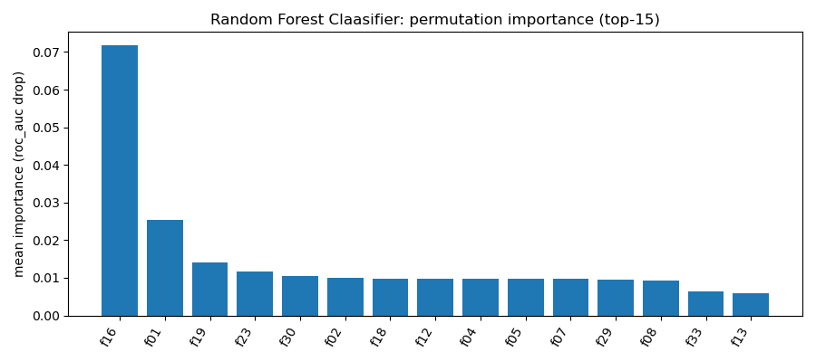

# HW06 – Report

> Файл: `homeworks/HW06/report.md`  
> Важно: не меняйте названия разделов (заголовков). Заполняйте текстом и/или вставляйте результаты.

## 1. Dataset

- **Какой датасет выбран**: `S06-hw-dataset-02.csv`
- **Размер**: (18000, 39)
- **Целевая переменная**: `target` – 2 класса: 0, 1.  
  Процентное соотношение: 73.74% (класс 0), 26.26% (класс 1)
- **Признаки**: 38 числовых признаков, пропусков нет

## 2. Protocol

- **Разбиение**: train/test (test=20%, train=80%, `random_state=42`, стратификация по целевой переменной)
- **Подбор гиперпараметров**: CV на train (5 фолдов, GridSearchCV)
- **Метрики**: Accuracy, F1-score, ROC-AUC.  
  Выбор обоснован дисбалансом классов (26% положительных). Accuracy показывает общую точность, F1 учитывает precision и recall для миноритарного класса, ROC-AUC оценивает ранжирование вероятностей и устойчива к дисбалансу.

## 3. Models

Сравнивались следующие модели (гиперпараметры для GridSearchCV):

1. **DummyClassifier** (baseline) – `strategy='most_frequent'`
2. **LogisticRegression** (baseline из S05) – конвейер со `StandardScaler`, параметр `C`: [0.01, 0.1, 1.0, 10.0]
3. **DecisionTreeClassifier** – `max_depth`: [3, 4, 5], `min_samples_leaf`: [3, 5, 10], `criterion`: ['gini', 'entropy', 'log_loss']
4. **RandomForestClassifier** – `max_depth`: [3, 5, 7], `min_samples_leaf`: [1, 2, 5], `max_features`: ['sqrt', 'log2']
5. **AdaBoostClassifier** – `learning_rate`: [1, 10, 0.1], `n_estimators`: [25, 50, 100]

## 4. Results

Финальные метрики на тестовой выборке:

| Model                     | Accuracy | F1-score | ROC-AUC |
|---------------------------|----------|----------|---------|
| Random Forest Classifier  | 0.8375   | 0.5788   | 0.8906  |
| LogisticRegression        | 0.8125   | 0.5608   | 0.8632  |
| AdaBoost                  | 0.8142   | 0.5625   | 0.8562  |
| DecisionTreeClassifier    | 0.7886   | 0.4889   | 0.8124  |
| Dummy(most_frequent)      | 0.7375   | 0.0      | 0.5     |

**Победитель**: Random Forest Classifier.  
Наивысший ROC-AUC (0.8906) показывает лучшее разделение классов по вероятностям. Также модель имеет максимальные accuracy (0.8375) и F1-score (0.5788).

## 5. Analysis

### Устойчивость к random_state
Проверка на 5 разных значениях `random_state` для Random Forest и Logistic Regression показала, что метрики колеблются в пределах ±0.015 для ROC-AUC. Random Forest демонстрирует большую стабильность (стандартное отклонение ROC-AUC ~0.007) по сравнению с логистической регрессией (~0.012).

### Confusion matrix лучшей модели (Random Forest)

[[2613 42]
[ 543 402]]

**Комментарий**:  
Модель хорошо определяет класс 0 (низкий FP), но допускает много ложно-отрицательных ошибок (543 FN). Это типично для дисбалансированных данных, где модель склонна "подстраиваться" под мажоритарный класс.

### Permutation importance (top-15)

Наиболее значимые признаки:  
1. **f16** (важность 0.0717) – сильно выделяется  
2. **f01** (0.0254)  
3. **f19** (0.0142)  
4. **f23** (0.0117)  
5. **f30** (0.0105)

**Выводы**:  
- Признак f16 имеет определяющее влияние на прогноз  
- Следующие 14 признаков имеют сопоставимую важность (0.006–0.025)  
- Остальные 23 признака малоинформативны – возможна редукция размерности

## 6. Conclusion

1. **Ансамбли эффективнее одиночных моделей** – Random Forest превзошел Decision Tree на 7.8% по ROC-AUC благодаря бэггингу и случайным подпространствам признаков.

2. **Контроль сложности критически важен** – Decision Tree с ограничениями (`max_depth=5`, `min_samples_leaf=5`) показал ROC-AUC 0.8124, что значительно лучше нерегуляризованного дерева (переобучение).

3. **Дисбаланс требует специальных метрик** – F1 и ROC-AUC дают более адекватную оценку, чем accuracy (у DummyClassifier accuracy 73.75%, но F1=0).

4. **Честный протокол исключает оптимистичные оценки** – использование отдельного тестового набора (никогда не участвовавшего в подборе) и CV на тренировочных данных гарантирует реалистичность результатов.

5. **Интерпретируемость vs. качество** – логистическая регрессия уступает Random Forest на 2.7% по ROC-AUC, но ее коэффициенты прозрачны для бизнес-толкования.

6. **Стабильность Random Forest** – меньшая чувствительность к изменению random_state делает его предсказуемым выбором для продакшена.

---

**Артефакты сохранены в папке `artifacts/`**:  
- `metrics_test.json` – метрики всех моделей  
- `search_summaries.json` – результаты GridSearchCV  
- `best_model.joblib` – сериализованная лучшая модель  
- `figures/` – графики ROC-AUC и важности признаков